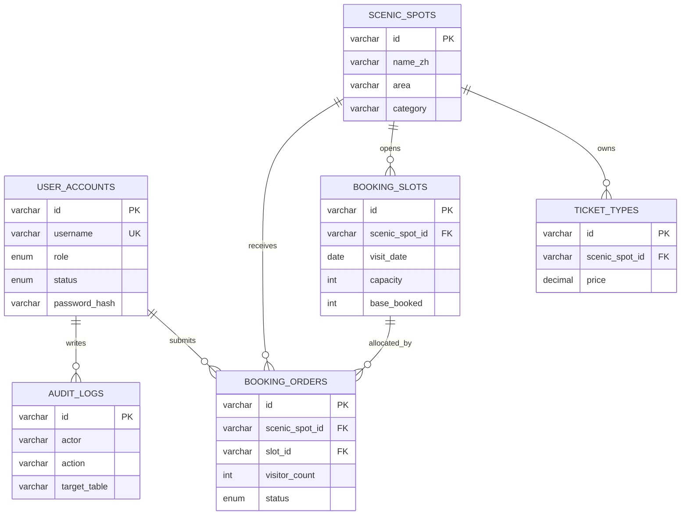

# 杭州文旅票务预约系统数据库设计

本项目包含前端、后端 API 和数据库三层：Vue 前端通过 `src/services/api.ts` 调用接口，完整模式下请求 `server/` 中的 Node API，并把数据持久化到 `data/hangzhou.sqlite`。数据库设计按 MySQL 8 建模，正式迁移脚本位于 [database/schema.sql](/Users/wangxinxiang/Desktop/hangzhou-vue/database/schema.sql)。只运行前端时，服务层会使用 `localStorage` 作为兜底，保证页面仍可预览。

## 1. 设计目标

系统面向两类角色：

- 游客：浏览景点、选择票种/通票、选择预约时段、提交订单、查看凭证和订单状态。
- 管理员：维护景点主数据、票种、预约时段、订单状态、账号权限和操作审计。

数据库需要支撑的核心能力：

- 景点、票种、时段、订单、用户、审计日志六类核心数据可持久化。
- 支持新增、查询、修改、删除等基础数据库操作。
- 支持订单状态流转，并用订单人数动态占用时段容量。
- 用主键、外键、唯一约束、枚举约束和检查约束保证数据一致性。
- 账号权限、密码哈希、隐私脱敏、操作审计满足基本安全要求。

## 2. 实体与职责

| 表名 | 实体 | 主要职责 |
| --- | --- | --- |
| `user_accounts` | 用户账号 | 保存管理员和普通用户，控制后台管理权限。 |
| `scenic_spots` | 景点主数据 | 保存景点名称、区域、分类、开放时间、推荐状态。 |
| `ticket_types` | 票种 | 保存某个景点下的票种、价格和适用人群。 |
| `booking_slots` | 预约时段 | 保存某个景点在某日某时段的容量和基础已约人数。 |
| `booking_orders` | 订单 | 保存游客预约、游客人数、支付状态、核销码和订单状态。 |
| `audit_logs` | 审计日志 | 保存关键写操作，用于追踪后台修改与异常排查。 |

## 3. 关系设计

核心关系如下：

- `scenic_spots 1:N ticket_types`：一个景点可以配置多个票种，一个票种只属于一个景点。
- `scenic_spots 1:N booking_slots`：一个景点可以配置多个日期时段，一个时段只属于一个景点。
- `scenic_spots 1:N booking_orders`：一个景点可以产生多张订单，一张订单对应一个景点。
- `booking_slots 1:N booking_orders`：一个时段可以被多张订单占用，一张订单只对应一个时段。
- `user_accounts 1:N booking_orders`：登录用户可以提交多张订单，订单也可兼容未登录/游客提交。
- `user_accounts 1:N audit_logs`：一个操作者可以产生多条审计日志。

简化 ER 关系：

## 4. 完整性规则

| 规则 | 实现方式 | 说明 |
| --- | --- | --- |
| 主键完整性 | 每张表设置 `id` 主键 | 所有记录都有稳定唯一标识。 |
| 外键完整性 | 票种、时段、订单关联景点；订单关联时段和用户 | 避免票种、时段、订单成为孤立数据。 |
| 时段唯一性 | `UNIQUE (scenic_spot_id, visit_date, time_range)` | 同一景点同日期同时段不能重复放票。 |
| 容量合法性 | `capacity > 0`，`base_booked <= capacity` | 防止无效容量和基础占用越界。 |
| 订单人数 | `visitor_count BETWEEN 1 AND 6` | 对应前台表单人数限制。 |
| 金额合法性 | `amount >= 0`，票价 `price >= 0` | 免费票用 0 元表示，金额不能为负。 |
| 状态枚举 | 订单、支付、退款、发票、账号状态均使用枚举 | 防止状态字符串随意写入。 |
| 删除保护 | 订单关联的景点和时段使用 `ON DELETE RESTRICT` | 有未取消订单时不允许破坏历史业务关联。 |

Node API 和前端兜底服务层都实现了同样的业务校验：不存在景点时不能新增票种/时段，重复时段会被拒绝，删除有有效订单的景点或时段会被拒绝，订单人数超过余量时不能提交。

## 5. 业务流

1. 管理员维护 `scenic_spots`，前台景点列表和详情页同步读取。
2. 管理员为景点配置 `ticket_types` 和 `booking_slots`。
3. 游客在预约页选择景点、票种、时段并填写实名信息。
4. 系统查询时段余量：`remaining = capacity - base_booked - 有效订单人数`。
5. 若余量足够，写入 `booking_orders`，生成订单号和核销码。
6. 管理员在后台核销、取消或恢复订单，订单状态变化会影响时段余量。
7. 所有关键写操作写入 `audit_logs`，便于追踪谁在何时修改了什么。

## 6. 查询与性能

脚本中设置了常用索引：

- `idx_scenic_spots_area_category`：用于景点区域和分类筛选。
- `idx_scenic_spots_featured`：用于首页推荐景点。
- `idx_ticket_spot`：用于按景点加载票种。
- `idx_slot_lookup`：用于按景点和日期查询预约时段。
- `idx_order_status_date`：用于后台按状态和时间管理订单。
- `idx_order_spot_slot`：用于统计景点和时段订单占用。
- `idx_audit_actor_time`、`idx_audit_target`：用于审计日志按人、时间、对象查询。

`vw_slot_availability` 视图把时段容量、基础已约、有效订单人数和剩余名额合并，方便真实后端直接查询实时余量。

## 7. 安全与隐私

- 密码字段保存为 `password_hash`，不保存明文密码。
- 后台账号使用 `role` 和 `status` 控制权限。
- 订单证件号只保存 `masked_id_number`。
- 手机号在管理端可按需要做脱敏展示。
- 审计日志记录新增、修改、删除、核销、重置等关键写操作。
- 系统维护提供订单表恢复和整库恢复，用于课程演示或异常数据恢复。

## 8. 测试用例

| 编号 | 测试目标 | 操作 | 预期结果 |
| --- | --- | --- | --- |
| TC-01 | 外键校验 | 为不存在的景点新增票种 | 系统拒绝，提示所属景点不存在。 |
| TC-02 | 唯一约束 | 同景点同日期同时段重复新增时段 | 系统拒绝，提示时段已存在。 |
| TC-03 | 容量校验 | 提交人数超过剩余名额的订单 | 订单不生成，余量不变化。 |
| TC-04 | 删除保护 | 删除仍有未取消订单的景点或时段 | 系统拒绝删除。 |
| TC-05 | 状态流转 | 将待出行订单核销、取消、恢复 | 状态正确变化，取消订单释放余量。 |
| TC-06 | 权限安全 | 删除最后一个启用管理员 | 系统拒绝，保证后台仍有可用管理员。 |
| TC-07 | 审计追踪 | 新增/修改/删除业务数据 | `audit_logs` 出现对应操作记录。 |

## 9. 前端实现对应关系

| 数据表 | 前端数据/接口 |
| --- | --- |
| `user_accounts` | `server/seed.mjs` 初始数据，`fetchUserAccounts`，账号权限后台 |
| `scenic_spots` | SQLite 表 `scenic_spots`，`fetchScenicSpots`，景点页/详情页/后台景点管理 |
| `ticket_types` | SQLite 表 `ticket_types`，`fetchTicketTypes`，预约页/后台票种管理 |
| `booking_slots` | SQLite 表 `booking_slots`，`fetchBookingSlots`，预约页/后台时段管理 |
| `booking_orders` | SQLite 表 `booking_orders`，`createBookingOrder`，订单中心/后台订单管理 |
| `audit_logs` | SQLite 表 `audit_logs`，`fetchAuditLogs`，账号权限后台的最近操作 |
